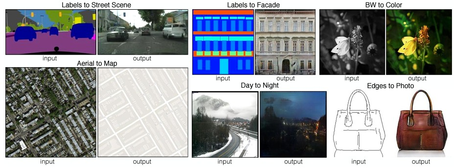

# 몽타주 그림을 통한 실제 얼굴 생성

## 0. Period

    2022.11.30 ~ 2022.12.05

## 1. Data Source

### 1.1. Data

[페르소나 기반의 가상 인물 몽타주 데이터](https://www.aihub.or.kr/aihubdata/data/view.do?currMenu=115&topMenu=100&aihubDataSe=realm&dataSetSn=618)

## 2. Goal

 (1) 몽타주 그림을 통해 실물 얼굴 생성

## 3. Used Model : [pix2pix](https://arxiv.org/abs/1611.07004)

### 3.1. Why

- 논문에 따르면 input domain에서 target domain으로 변환을 

## 4. Training

 - 몽타주 이미지와 실물 사진 1천장으로 학습